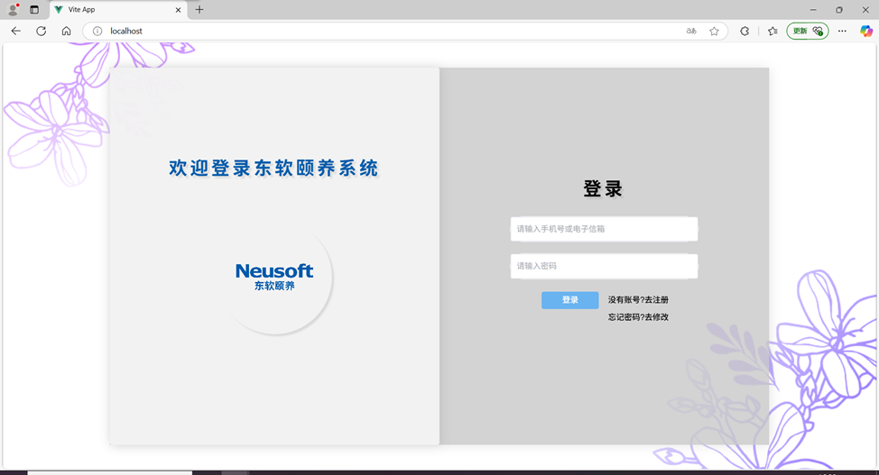
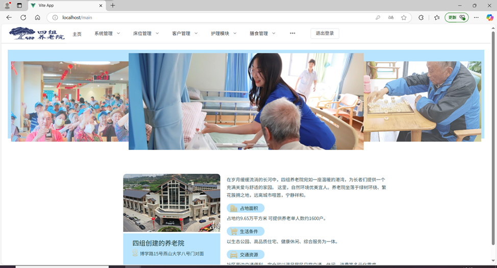
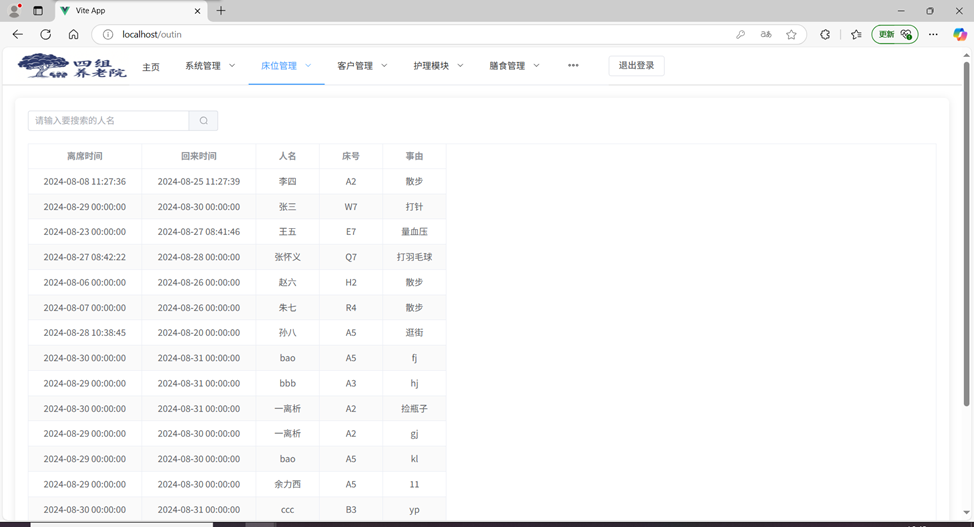
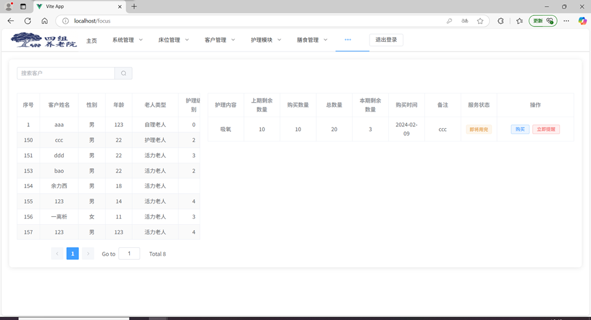
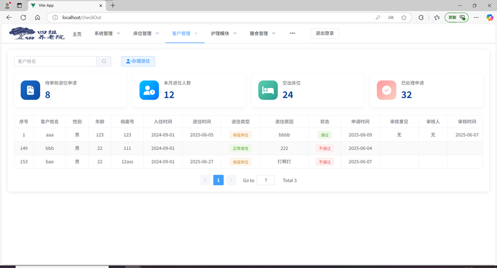
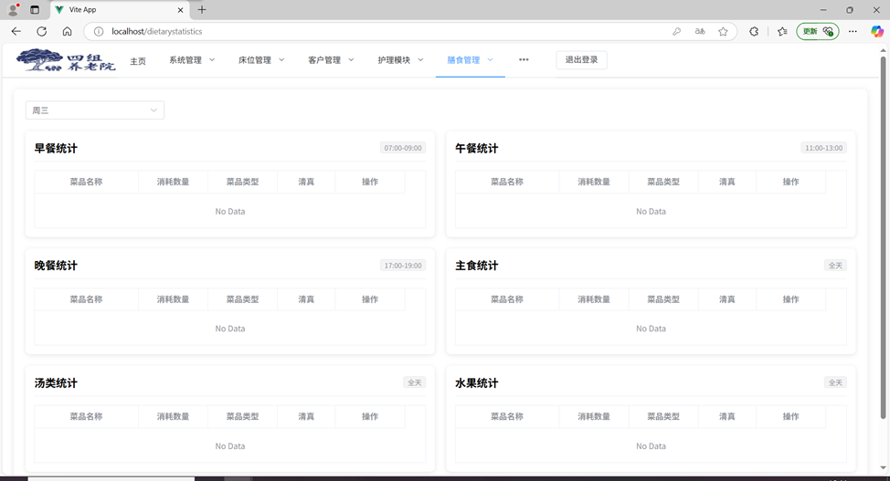
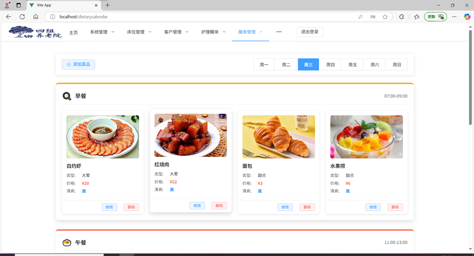
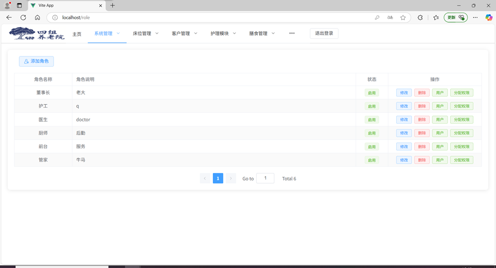

# Neusoft-Elderly-Care-Center
东软颐养中心、一款为养老院及颐养中心设计的综合管理平台

# 运行环境
nodejs版本:node:'v20.15.1'. npm:'10.8.2'

Java  版本:jdk1.8.0_271

Redis 版本:x64-5.0.14.1

Mysql 版本:8

# 运行方法

1. 配置好Myqsl和Redis环境

2. yandavue3文件是前端、carecenterJava文件是后端，分别运行相应文件。
前端：
npm install 
npm run dev

# 项目效果展示

登陆

首页

床位管理

服务关注

客户管理

膳食管理

膳食日历

系统管理

